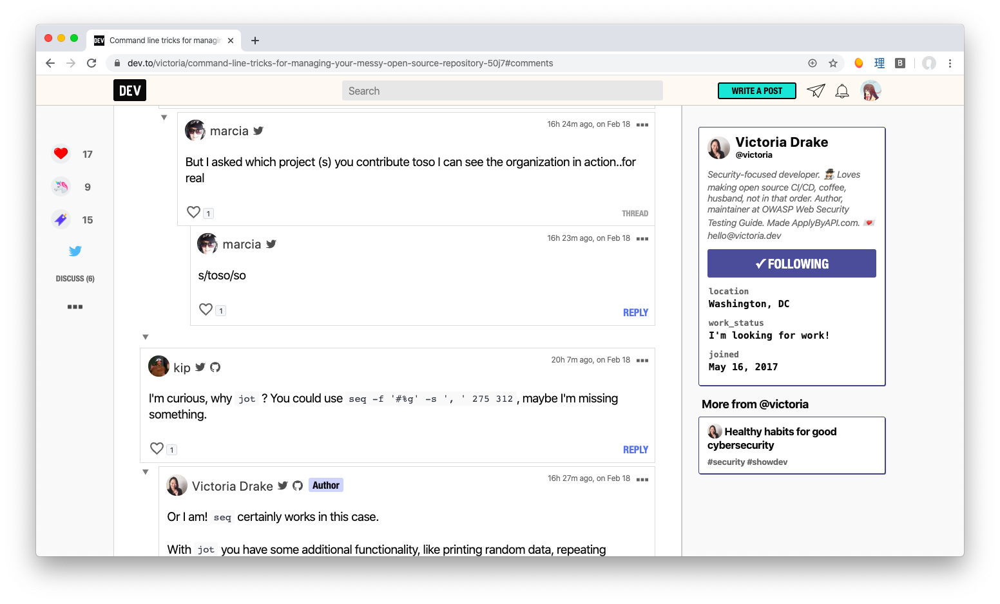

# better-[dev.to](https://dev.to)

Add specific features to Dev.to, such as humanize-duration

<https://dev.to/patarapolw/showing-comments-publish-date-isn-t-good-2ifh>

## How to install

- Clone this project, or visit [releases](https://github.com/patarapolw/better-dev.to/releases)
- `yarn && yarn build`
- Go to Chrome / Chromium browser, and visit [chrome://extensions](chrome://extensions)
- Load Unpacked, and select this folder

## What files are really required

The only required files in production are

- `manifest.json`
- `dist/**/*.js`
